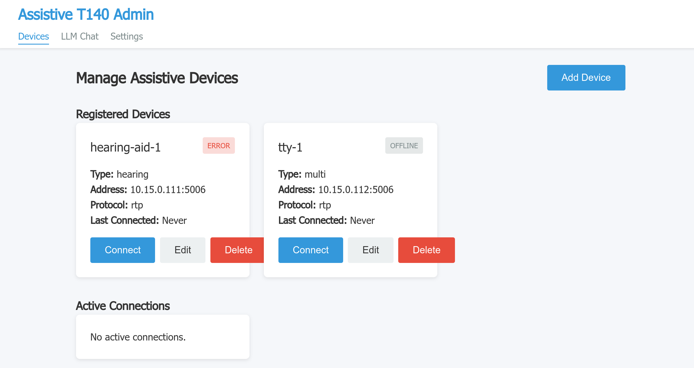
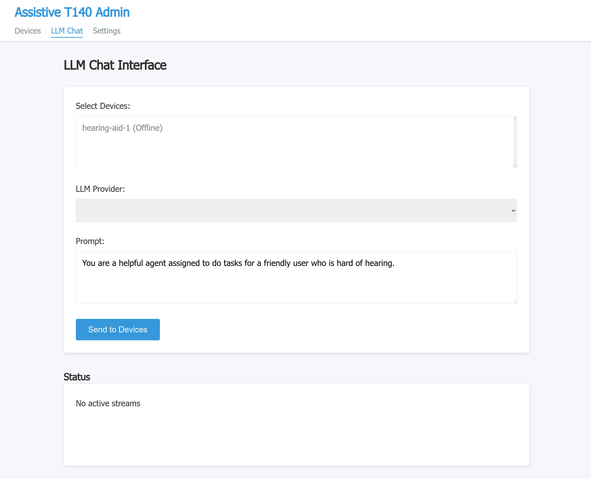
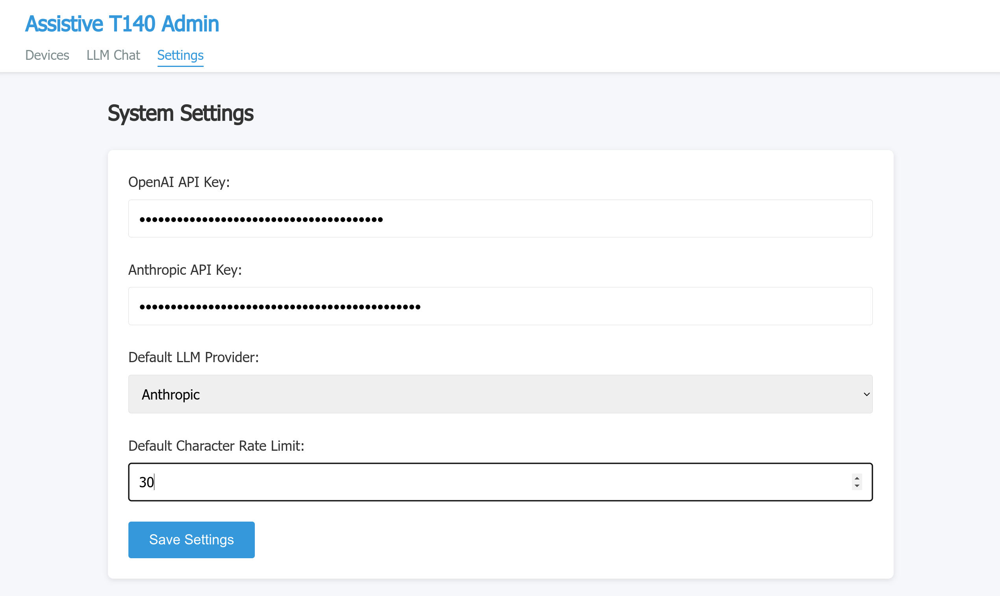

# Assistive LLM

A comprehensive assistive device interface for LLM streaming using the T.140 real-time text protocol. This application helps users with disabilities, particularly those who are deaf or hard-of-hearing, by providing real-time text communication from large language models (LLMs) to their assistive devices.

## Features

### Core Features
- **Multiple Transport Protocols**: WebSocket, RTP, SRTP, Unix sockets (STREAM and SEQPACKET)
- **LLM Provider Support**: OpenAI GPT models and Anthropic Claude models
- **Advanced T.140 Features**:
  - Forward Error Correction (FEC)
  - Redundancy (RED) for reliability
  - Configurable character rate limiting
  - Backspace processing
- **Device Management**: Easy-to-use web interface for managing assistive devices
- **Conversation History**: Persistent conversation tracking and management
- **Real-time Streaming**: Native t140llm integration for optimal performance
- **Security**: SRTP support for encrypted communications

### Supported Device Types
- Hearing devices (for deaf or hard-of-hearing users)
- Visual devices (for blind or low vision users)
- Mobility devices (for users with mobility impairments)
- Cognitive devices (for users with cognitive disabilities)
- Multi-purpose devices

## Screenshots

### Device Management Interface

*Manage all your assistive devices, view connection status, and control device connections from a single interface.*

### LLM Chat Interface

*Send prompts to one or multiple devices simultaneously, with real-time streaming from OpenAI or Anthropic LLMs.*

### System Settings

*Configure API keys, default providers, and global system settings.*

## Table of Contents

- [Quick Start](#quick-start)
- [Prerequisites](#prerequisites)
- [Installation](#installation)
- [Configuration](#configuration)
- [User Guides](#user-guides)
  - [First-Time Setup](#first-time-setup)
  - [Adding Your First Device](#adding-your-first-device)
  - [Streaming LLM Responses](#streaming-llm-responses)
  - [Managing Conversations](#managing-conversations)
  - [Advanced Features](#advanced-features)
- [API Documentation](#api-documentation)
- [Troubleshooting](#troubleshooting)
- [Cloud Deployment](#cloud-deployment)
- [Contributing](#contributing)

## Quick Start

Get up and running in 5 minutes:

```bash
# 1. Clone and install
git clone https://github.com/agrathwohl/assistive-llm.git
cd assistive-llm
npm install

# 2. Configure (add your API keys)
cp .env.example .env
nano .env  # Add your ANTHROPIC_API_KEY or OPENAI_API_KEY

# 3. Build and run
npm run build
npm start

# 4. Open browser
open http://localhost:3000
```

## Prerequisites

- [Node.js](https://nodejs.org/) >= 10.18.1
- [npm](https://www.npmjs.com/) >= 6.13.4
- OpenAI and/or Anthropic API keys (at least one is required)
- An assistive device that supports T.140 protocol (for testing)

## Installation

### Standard Installation

1. **Clone the repository:**

```bash
git clone https://github.com/agrathwohl/assistive-llm.git
cd assistive-llm
```

2. **Install dependencies:**

```bash
npm install
```

3. **Create environment file:**

```bash
cp .env.example .env
```

4. **Edit `.env` and add your API keys:**

```env
# Required: At least one LLM provider API key
ANTHROPIC_API_KEY=sk-ant-xxxxxxxxxxxxx
# OR
OPENAI_API_KEY=sk-xxxxxxxxxxxxx
```

5. **Build the application:**

```bash
npm run build
```

6. **Start the server:**

```bash
npm start
```

The server will be available at `http://localhost:3000`.

### Development Installation

For development with auto-reload:

```bash
npm run dev
```

## Configuration

### Environment Variables

Create a `.env` file with the following variables:

```env
# Server Configuration
PORT=3000                    # Server port (default: 3000)
HOST=localhost               # Server host (default: localhost)

# LLM Provider Configuration
DEFAULT_LLM_PROVIDER=anthropic              # Default provider: 'openai' or 'anthropic'
ANTHROPIC_API_KEY=sk-ant-xxxxxxxxxxxxx     # Your Anthropic API key
ANTHROPIC_MODEL=claude-3-5-sonnet-20241022 # Claude model to use
OPENAI_API_KEY=sk-xxxxxxxxxxxxx            # Your OpenAI API key
OPENAI_MODEL=gpt-4                         # GPT model to use

# Logging Configuration
LOG_LEVEL=info               # Logging level: debug, info, warn, error
LOG_FILE=assistive-llm.log   # Log file path

# Storage Configuration
DB_PATH=./data               # Data directory for device configs and conversations
```

### Getting API Keys

#### Anthropic Claude
1. Visit [Anthropic Console](https://console.anthropic.com/)
2. Sign up or log in
3. Navigate to API Keys
4. Create a new key
5. Copy and add to `.env` as `ANTHROPIC_API_KEY`

#### OpenAI
1. Visit [OpenAI Platform](https://platform.openai.com/)
2. Sign up or log in
3. Go to API Keys section
4. Create new secret key
5. Copy and add to `.env` as `OPENAI_API_KEY`

---

## User Guides

### First-Time Setup

#### Step 1: Access the Admin Interface

After starting the server, open your web browser and navigate to:

```
http://localhost:3000
```

You'll see the admin interface with three main sections:
- **Devices**: Manage assistive devices
- **LLM Chat**: Stream responses to devices
- **Settings**: Configure system settings

#### Step 2: Verify LLM Provider Status

1. Click on the **LLM Chat** tab
2. Check that at least one provider shows as available
3. If no providers are available, verify your API keys in `.env`

#### Step 3: Test the System

Before connecting real devices, you can test the API endpoints:

```bash
# Check available providers
curl http://localhost:3000/api/llm/providers

# Should return:
# [
#   {"provider":"openai","available":true,"model":"gpt-4"},
#   {"provider":"anthropic","available":true,"model":"claude-3-5-sonnet-20241022"}
# ]
```

---

### Adding Your First Device

#### Via Web Interface

1. **Navigate to Devices Page**
   - Click on "Devices" in the navigation menu
   - Click the "Add Device" button (blue button, top right)

2. **Fill in Basic Information**
   ```
   Device Name: My Test Device
   Device Type: Hearing Device (or appropriate type)
   IP Address: 192.168.1.100 (your device's IP)
   Port: 5004 (your device's T.140 port)
   Protocol: RTP (or websocket/srtp depending on device)
   ```

3. **Configure Advanced Settings** (Optional)
   - **Character Rate Limit**: 30 characters/second (default)
     - Lower for slower devices
     - Higher for capable devices (max 100)

   - **Process Backspaces**: Checked (recommended)
     - Processes backspace characters in stream
     - Uncheck for raw output

   - **Enable FEC**: Unchecked (default)
     - Check for unreliable networks
     - Adds forward error correction

   - **Enable RED**: Unchecked (default)
     - Check for lossy connections
     - Sends redundant data (1-3 generations)

4. **Save Device**
   - Click "Save Device"
   - Device appears in "Registered Devices" list

#### Protocol Selection Guide

**WebSocket** - Best for:
- Modern web-based assistive devices
- Devices behind NAT/firewalls
- Testing and development
- Browser-based clients

**RTP** - Best for:
- Traditional T.140 devices
- Low-latency requirements
- Direct device connections
- VoIP-integrated systems

**SRTP** - Best for:
- Secure communications required
- Medical/healthcare applications
- Privacy-sensitive scenarios
- Encrypted channels needed

**Unix Sockets** - Best for:
- Local device communication
- Inter-process communication
- Development and testing
- High-performance local apps

---

### Connecting to a Device

#### Manual Connection

1. **From Devices Page:**
   - Find your device in "Registered Devices"
   - Click the "Connect" button
   - Status changes to "Connecting..." then "Online"

2. **Verify Connection:**
   - Device appears in "Active Connections" section
   - Status badge shows green "Online"
   - Connection timestamp displayed

3. **Troubleshooting Connection Issues:**

   **Device stays in "Connecting" status:**
   - Verify device is powered on and reachable
   - Check IP address and port are correct
   - Ensure no firewall blocking connection
   - Test network connectivity: `ping <device-ip>`

   **Connection shows "Error" status:**
   - Check device logs for errors
   - Verify protocol matches device expectations
   - For SRTP: Verify keys/passphrase
   - For Unix sockets: Verify socket path exists

#### Programmatic Connection (API)

```bash
# Connect to device via API
curl -X POST http://localhost:3000/api/devices/{device-id}/connect \
  -H "Content-Type: application/json"

# Response:
# {
#   "message": "Connected to device successfully",
#   "connection": { ... }
# }
```

---

### Streaming LLM Responses

#### Basic Streaming (Web Interface)

1. **Navigate to LLM Chat Page**
   - Click "LLM Chat" in navigation

2. **Select Target Devices**
   - Click in "Select Devices" dropdown
   - Choose one or more connected devices
   - Only online devices are selectable

3. **Choose LLM Provider**
   - Select "OpenAI" or "Anthropic" from dropdown
   - Ensure provider shows as available

4. **Enter Your Prompt**
   ```
   Example prompts:
   - "Explain quantum computing in simple terms"
   - "What are the symptoms of the flu?"
   - "Tell me a short story about a robot"
   ```

5. **Send to Devices**
   - Click "Send to Devices"
   - Watch status display for streaming info
   - Response streams in real-time to selected devices

#### Streaming Features

**Real-time Display**: Text appears character-by-character on assistive device as LLM generates it.

**Multi-device Broadcasting**: Send same response to multiple devices simultaneously.

**Conversation Context**: System maintains conversation history for context-aware responses.

#### Advanced Streaming (API)

**Stream to Single Device:**
```bash
curl -X POST http://localhost:3000/api/llm/stream/{device-id} \
  -H "Content-Type: application/json" \
  -d '{
    "prompt": "What is the weather forecast?",
    "provider": "anthropic"
  }'

# Response includes conversationId for follow-ups:
# {
#   "message": "Started streaming...",
#   "conversationId": "abc-123",
#   "messageId": "msg-456",
#   "provider": "anthropic"
# }
```

**Stream to Multiple Devices:**
```bash
curl -X POST http://localhost:3000/api/llm/stream-multiple \
  -H "Content-Type: application/json" \
  -d '{
    "deviceIds": ["device-1", "device-2"],
    "prompt": "Tell me about accessibility technology",
    "provider": "openai"
  }'
```

**Continue Conversation:**
```bash
curl -X POST http://localhost:3000/api/llm/stream/{device-id} \
  -H "Content-Type: application/json" \
  -d '{
    "prompt": "Tell me more about that",
    "provider": "anthropic",
    "conversationId": "abc-123"
  }'
```

---

### Managing Conversations

#### Viewing Conversation History

**Via API:**
```bash
# Get specific conversation
curl http://localhost:3000/api/llm/conversations/{conversation-id}

# Get device's recent conversations
curl http://localhost:3000/api/llm/devices/{device-id}/conversations?limit=10
```

**Response Format:**
```json
{
  "conversationId": "abc-123",
  "messages": [
    {
      "id": "msg-1",
      "role": "user",
      "content": "What is quantum computing?",
      "timestamp": "2025-01-04T12:00:00Z",
      "provider": "anthropic",
      "model": "claude-3-5-sonnet-20241022"
    },
    {
      "id": "msg-2",
      "role": "assistant",
      "content": "Quantum computing is...",
      "timestamp": "2025-01-04T12:00:05Z"
    }
  ]
}
```

#### Clearing Conversations

```bash
# Clear specific conversation
curl -X DELETE http://localhost:3000/api/llm/conversations/{conversation-id}
```

**Use Cases:**
- Privacy: Clear sensitive conversations
- Testing: Reset conversation state
- Maintenance: Clean up old data

---

### Advanced Features

#### Forward Error Correction (FEC)

**When to Enable:**
- Unreliable network connections
- High packet loss environments
- Long-distance connections
- Critical communications

**How to Enable:**
1. Edit device settings
2. Check "Enable FEC"
3. Save device
4. Reconnect to device

**Technical Details:**
- Adds parity data to T.140 stream
- Recovers from packet loss
- Slight latency increase
- Recommended for <5% packet loss

#### Redundancy (RED)

**When to Enable:**
- Very lossy networks (>5% loss)
- Mission-critical applications
- Emergency communications
- Unreliable connections

**Configuration:**
1. Edit device settings
2. Check "Enable RED"
3. Choose generations (1-3)
4. Save and reconnect

**Generation Guide:**
- **1 generation**: Mild packet loss (5-10%)
- **2 generations**: Moderate loss (10-20%)
- **3 generations**: High loss (>20%)

**Trade-offs:**
- Higher redundancy = more bandwidth
- Increased reliability
- Higher latency

#### SRTP Encryption

**Setup Method 1: Passphrase (Simple)**
1. Select "SRTP" protocol
2. Device settings: Enter passphrase
3. Keys generated automatically
4. Save device

**Setup Method 2: Manual Keys (Advanced)**
1. Generate keys:
   ```bash
   # Using OpenSSL
   openssl rand -base64 30  # Master key
   openssl rand -base64 14  # Salt
   ```
2. Add to device settings:
   - SRTP Key: (base64 master key)
   - SRTP Salt: (base64 salt)
3. Save device

**Security Notes:**
- Use SRTP for sensitive data
- Keys stored locally only
- Change keys periodically
- Use strong passphrases

#### Character Rate Limiting

**Optimization Guide:**

| Device Type | Recommended Rate | Notes |
|-------------|------------------|-------|
| Standard TTY | 30 cps | Default, works well |
| Fast display | 50-60 cps | Modern devices |
| Slow display | 15-20 cps | Older devices |
| Braille | 10-15 cps | Reading speed |
| Testing | 100 cps | Development only |

**Tuning Process:**
1. Start with 30 cps
2. Test with device
3. Adjust based on:
   - Display refresh rate
   - User comfort
   - Network capacity
4. Save optimal setting

---

## API Documentation

### Complete API Reference

#### Device Management Endpoints

**Get All Devices**
```http
GET /api/devices
```
Returns array of all registered devices.

**Get Specific Device**
```http
GET /api/devices/:id
```

**Create Device**
```http
POST /api/devices
Content-Type: application/json

{
  "name": "My Device",
  "type": "hearing",
  "ipAddress": "192.168.1.100",
  "port": 5004,
  "protocol": "rtp",
  "settings": {
    "characterRateLimit": 30,
    "backspaceProcessing": true,
    "enableFEC": false,
    "enableRED": false
  }
}
```

**Update Device**
```http
PUT /api/devices/:id
Content-Type: application/json

{
  "name": "Updated Name",
  "settings": { ... }
}
```

**Delete Device**
```http
DELETE /api/devices/:id
```

**Connect to Device**
```http
POST /api/devices/:id/connect
```

**Disconnect from Device**
```http
POST /api/devices/:id/disconnect
```

**Get Active Connections**
```http
GET /api/devices/connections/active
```

#### LLM Streaming Endpoints

**Get Available Providers**
```http
GET /api/llm/providers

Response:
[
  {
    "provider": "openai",
    "available": true,
    "model": "gpt-4"
  },
  {
    "provider": "anthropic",
    "available": true,
    "model": "claude-3-5-sonnet-20241022"
  }
]
```

**Stream to Single Device**
```http
POST /api/llm/stream/:deviceId
Content-Type: application/json

{
  "prompt": "Your question here",
  "provider": "anthropic",
  "conversationId": "optional-conversation-id"
}

Response:
{
  "message": "Started streaming LLM response to device",
  "provider": "anthropic",
  "conversationId": "abc-123",
  "messageId": "msg-456"
}
```

**Stream to Multiple Devices**
```http
POST /api/llm/stream-multiple
Content-Type: application/json

{
  "deviceIds": ["device-1", "device-2"],
  "prompt": "Your question here",
  "provider": "openai"
}
```

**Get Conversation History**
```http
GET /api/llm/conversations/:conversationId
```

**Get Device Conversations**
```http
GET /api/llm/devices/:deviceId/conversations?limit=10
```

**Clear Conversation**
```http
DELETE /api/llm/conversations/:conversationId
```

### Error Responses

All endpoints return standard error format:

```json
{
  "error": "Description of error",
  "details": "Additional information (optional)"
}
```

Common HTTP status codes:
- `200`: Success
- `400`: Bad request (validation error)
- `404`: Resource not found
- `500`: Server error

---

## Troubleshooting

### Common Issues and Solutions

#### "At least one LLM provider API key must be configured"

**Cause:** No valid API keys in `.env` file

**Solution:**
1. Check `.env` file exists
2. Verify API key format is correct
3. Ensure no extra spaces or quotes
4. Restart server after changing `.env`

```bash
# Correct format:
ANTHROPIC_API_KEY=sk-ant-xxxxxxxxxxxxx

# Incorrect (no quotes needed):
ANTHROPIC_API_KEY="sk-ant-xxxxxxxxxxxxx"
```

#### Device Connection Fails

**WebSocket Connection Issues:**
```bash
# Test WebSocket connectivity
wscat -c ws://device-ip:port

# If fails, check:
# 1. Device is powered on
# 2. Network is reachable
# 3. Firewall allows WebSocket connections
```

**RTP Connection Issues:**
```bash
# Test UDP connectivity
nc -u device-ip port

# Check:
# 1. Device listens on UDP port
# 2. No firewall blocking UDP
# 3. IP address is correct
```

**SRTP Connection Issues:**
- Verify passphrase is correct
- Check key/salt are valid base64
- Ensure device supports SRTP
- Try RTP first to isolate encryption issues

#### Streaming Doesn't Work

**Check 1: Device Connected**
```bash
curl http://localhost:3000/api/devices/connections/active
# Device should appear in list
```

**Check 2: Provider Available**
```bash
curl http://localhost:3000/api/llm/providers
# Provider 'available' should be true
```

**Check 3: API Key Valid**
- Test key directly with provider
- Check for expired keys
- Verify billing/credits available

**Check 4: Server Logs**
```bash
tail -f assistive-llm.log
# Look for error messages during streaming
```

#### Build Fails

**Issue:** TypeScript compilation errors

**Solution:**
```bash
# Clean and reinstall
rm -rf node_modules dist
npm install
npm run build
```

**Issue:** Missing dependencies

**Solution:**
```bash
npm install --save t140llm
npm install
```

#### Performance Issues

**Slow streaming:**
1. Check network latency to device
2. Reduce character rate limit
3. Disable FEC/RED if not needed
4. Check server CPU/memory usage

**High latency:**
1. Test network: `ping device-ip`
2. Check LLM provider status
3. Reduce redundancy generations
4. Use faster LLM model

### Getting Help

**Log Files:**
```bash
# View recent logs
tail -f assistive-llm.log

# Search for errors
grep ERROR assistive-llm.log
```

**Debug Mode:**
```env
# In .env file
LOG_LEVEL=debug
```

**Community Support:**
- GitHub Issues: Report bugs and request features
- Documentation: Check docs for detailed guides
- t140llm Library: Check [t140llm documentation](https://github.com/agrathwohl/t140llm)

---

## Cloud Deployment

See [CLOUD_DEPLOYMENT.md](./CLOUD_DEPLOYMENT.md) for detailed instructions on deploying to cloud providers including:
- Vercel
- Cloudflare Workers
- AWS
- Google Cloud Platform
- Azure

---

## Development

### Project Structure

```
assistive-llm/
├── src/
│   ├── config/              # Configuration management
│   │   └── config.ts        # App configuration
│   ├── controllers/         # API controllers
│   │   ├── device.controller.ts
│   │   └── llm.controller.ts
│   ├── interfaces/          # TypeScript interfaces
│   │   ├── device.interface.ts
│   │   └── api.interface.ts
│   ├── middleware/          # Express middleware
│   │   └── error.middleware.ts
│   ├── public/              # Static web files
│   │   ├── css/            # Stylesheets
│   │   ├── js/             # Client JavaScript
│   │   └── index.html      # Admin interface
│   ├── routes/              # API routes
│   │   ├── device.routes.ts
│   │   ├── llm.routes.ts
│   │   └── index.ts
│   ├── services/            # Business logic
│   │   ├── device.service.ts
│   │   ├── llm.service.ts
│   │   └── conversation.service.ts
│   └── utils/               # Utility functions
│       └── logger.ts
├── dist/                    # Compiled JavaScript (generated)
├── data/                    # Data storage (generated)
│   ├── devices.json
│   └── conversations.json
├── assets/                  # Documentation assets
├── .env.example             # Example environment file
├── package.json
├── tsconfig.json
└── README.md
```

### Running Tests

```bash
npm test
```

### Development Mode

```bash
npm run dev
```

Changes trigger automatic rebuild and restart.

### Building

```bash
npm run build
```

Compiles TypeScript to JavaScript in `dist/` directory.

---

## Contributing

Contributions are welcome! Please follow these guidelines:

1. Fork the repository
2. Create a feature branch (`git checkout -b feature/amazing-feature`)
3. Make your changes
4. Add tests if applicable
5. Commit your changes (`git commit -m 'Add amazing feature'`)
6. Push to the branch (`git push origin feature/amazing-feature`)
7. Open a Pull Request

### Development Guidelines

- Follow existing code style
- Add TypeScript types for new code
- Update documentation for new features
- Write clear commit messages
- Test thoroughly before submitting PR

---

## License

MIT License - see [LICENSE](LICENSE) file for details

---

## Acknowledgments

- Built with [t140llm](https://github.com/agrathwohl/t140llm) by agrathwohl
- Supports OpenAI and Anthropic LLM providers
- Designed for accessibility and real-time communication
- Implements ITU-T T.140 real-time text protocol

---

## Support

For issues, questions, or suggestions:
- **GitHub Issues**: [Report bugs or request features](https://github.com/agrathwohl/assistive-llm/issues)
- **Documentation**: Check this README and linked docs
- **t140llm Library**: [t140llm documentation](https://github.com/agrathwohl/t140llm)

---

## Changelog

### Version 1.0.0 (Current)
- Initial release with comprehensive t140llm integration
- Support for WebSocket, RTP, SRTP, and Unix socket transports
- OpenAI and Anthropic provider support
- Conversation history and management
- Advanced T.140 features (FEC, RED, redundancy)
- Web-based admin interface
- Device management and connection handling
- RESTful API with comprehensive endpoints
- Real-time streaming with character rate limiting
- Secure SRTP communications
- Comprehensive documentation and user guides
